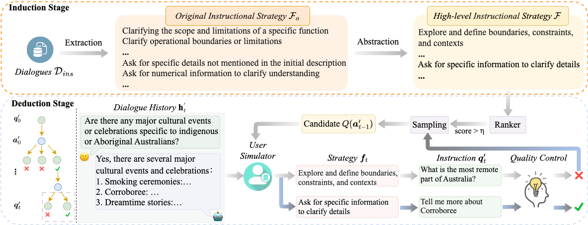

# Inductive-Deductive Strategy Reuse for Multi-Turn Instructional Dialogues

[📄Paper](https://arxiv.org/pdf/2404.11095.pdf)

----------

## Abstract
Aligning large language models (LLMs) with human expectations requires high-quality instructional dialogues, which can be achieved by raising diverse, in-depth, and insightful instructions that deepen interactions.
Existing methods target instructions from real instruction dialogues as a learning goal and fine-tune a user simulator for posing instructions.
However, the user simulator struggles to implicitly model complex dialogue flows and pose high-quality instructions.
In this paper, we take inspiration from the cognitive abilities inherent in human learning and propose the explicit modeling of complex dialogue flows through instructional strategy reuse.
Specifically, we first induce high-level strategies from various real instruction dialogues.
These strategies are applied to new dialogue scenarios deductively, where the instructional strategies facilitate high-quality instructions.
Experimental results show that our method can generate diverse, in-depth, and insightful instructions for a given dialogue history. The constructed multi-turn instructional dialogues can outperform competitive baselines on the downstream chat model.

## Arcitacture


## Getting Started

### Induction

#### Oringinal Instructional Strategies Extraction
``` 
cd induction
python strategy_extraction.py.py --data_path [data_path] --save_path [save_path]
``` 

#### High-level Instructional Strategies Abstraction
To cluster similar strategies:
```
cd induction
python sbert_for_similarity.py --model_path [model_path] --data_path [data_path]

```
To abstract the strategies within each cluster 
```
python strategy_abstraction.py --data_path [data_path] --save_path [save_path] --embedding_cache_path[--embedding_cache_path] --save_path[--save_path]
``` 


#### User Simulator Training
We provide training code to fine-tune LLaMa-2. You need to prepare the base model (LLaMa-2 or other models you like) and run the following training script. It should take 5-6 hours to train on 64 A100 GPUs. 
```
### to fine-tune a user simulator
cd induction/
bash run_user_simulator.sh

```

### Deduction

#### Inferencing
```
cd deduction/
CUDA_VISIBLE_DEVICES=0 python infer.py "model_name_or_path" "tokenizer_path" 4096 "./data/infer_p_chat_sharegpt_10k.json"  "category_path" "./data/output/infer_gpt4_reward_model_10k
### Chat Model Training
We provide training code to fine-tune LLaMa-2. You need to prepare the base model (LLaMa-2 or other models you like) and run the following training script. It should take 2.5 hours to train on 1 A100 GPUs. 
```
### to fine-tune a chat model
```
cd deduction/
bash run_chat_model.sh

```

## Citation
```
@misc{ou2024inductivedeductive,
      title={Inductive-Deductive Strategy Reuse for Multi-Turn Instructional Dialogues}, 
      author={Jiao Ou and Jiayu Wu and Che Liu and Fuzheng Zhang and Di Zhang and Kun Gai},
      year={2024},
      eprint={2404.11095},
      archivePrefix={arXiv},
      primaryClass={cs.CL}
}
```